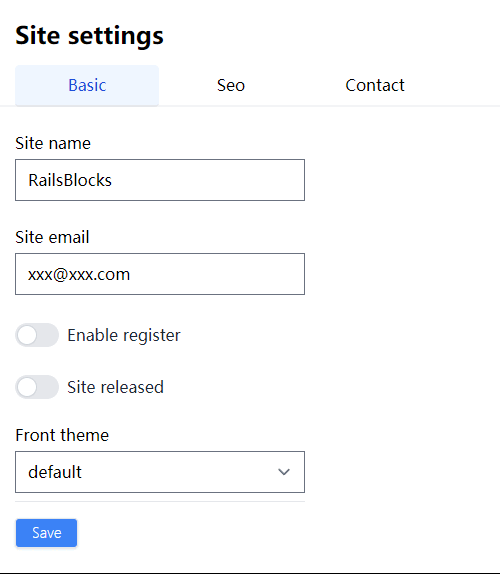

# Site Settings Feature

The site configuration uses a dynamic form. The configuration items are defined in the model, and the form page is automatically displayed. Below is an actual example.

```ruby
class Site < ApplicationRecord
  self.table_name_prefix = "st_"
  include MetaAttribute

  # Usage: Site.current.site_name
  section "basic" do
    meta_attribute "site_name", type: :string
    meta_attribute "site_email", type: :string
    meta_attribute "enable_register", type: :bool
    meta_attribute "site_released", type: :bool
    meta_attribute "front_theme", type: :string, form_ctrl: "select",
      ctrl_data: Rails.application.config.sitebuilder.themes
  end

  section "seo" do
    meta_attribute "keywords", type: :string
    meta_attribute "description", type: :string, form_ctrl: "textarea"
  end

  section "contact" do
    meta_attribute "contact_address", type: :string
    meta_attribute "contact_email", type: :string
  end

  def self.current
    Rails.cache.fetch("site_current") do
      where(selected: true).first # Site.where
    end
  end

end

```


